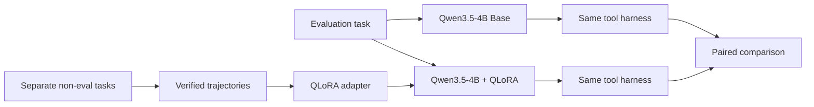

<h1 align="center">Small-Agent QLoRA</h1>

<p align="center">
  <strong>Can a local 4B tool agent learn a better tool-use policy with QLoRA — without hiding behind a larger model or benchmark leakage?</strong>
</p>

<p align="center">
  
  
  
  
  
</p>

<p align="center">
  <a href="#runtime">Runtime</a> ·
  <a href="#the-experiment">Experiment</a> ·
  <a href="#current-evidence">Evidence</a> ·
  <a href="#quickstart">Quickstart</a> ·
  <a href="#evaluation-contract">Evaluation</a>
</p>

## At a glance

| | |
|---|---|
| **Question** | Can QLoRA improve the tool-use policy of a small local agent, or does it mostly add training cost? |
| **What I built** | A single-model Qwen3.5-4B agent with `search`, `read`, `inspect`, and `python`, plus trajectory collection, QLoRA training, leakage guards, and a Base-vs-LoRA comparator. |
| **Runtime** | Local CLI with bounded tool I/O, explicit backend failure states, readiness checks, atomic run artifacts, and visible action traces. |
| **Current answer** | **Unanswered.** The experiment infrastructure exists, but there is no valid Base-vs-LoRA improvement claim yet. |
| **Design focus** | Controlled evaluation, visible trajectories, bounded tool use, and honest stop conditions under local hardware constraints. |

> [!NOTE]
> This repository treats **“QLoRA was not justified by the available evidence”** as a valid outcome. The goal is not to force a fine-tuning success story.

## Runtime

The runtime intentionally stays small: one model chooses a tool call or a final answer, and the harness owns execution boundaries around it.

```text
user task
   ↓
Qwen3.5-4B
   ↓
choose next action
   ├─ search
   ├─ read
   ├─ inspect
   └─ python
   ↓
observation
   ↓
next action or final answer
```

Operational behavior is explicit rather than hidden behind a larger agent framework:

- model timeouts, unavailable backends, capacity stops, and known model errors are recorded as distinct incomplete outcomes;
- tool exceptions become bounded observations so the model can change strategy;
- exact duplicate calls are blocked;
- URL reads block local/private destinations and stream within a source-size budget;
- workspace files are size-checked before expensive parsing;
- the Python tool runs in an isolated, time-limited subprocess with a restricted builtin surface;
- `small-agent doctor` checks local readiness without loading model weights;
- `small-agent run --output ...` writes an atomic `small-agent-run/v1` artifact with the answer, stop reason, metrics, trace, and effective runtime configuration.

This is a **production-style local runtime**, not a hardened multi-tenant service or hostile-code sandbox. There is no planner/router/critic graph.

## The experiment

The project isolates one question: **does policy fine-tuning improve the same small agent on the same evaluation tasks?**



The comparison is intentionally paired:

- same base model family
- same tool surface
- same step limits
- same evaluation partition
- same scorer
- only the adapter changes

That makes the result easier to interpret than comparing two unrelated agents.

## Current status

| Component | Status |
|---|---|
| Tool-using agent runtime | ✅ Implemented |
| Runtime readiness / failure contracts | ✅ Implemented |
| GAIA evaluation runner | ✅ Implemented |
| Visible trajectory logging | ✅ Implemented |
| Verified trajectory collector | ✅ Implemented |
| Training-data leakage guard | ✅ Implemented |
| QLoRA training entry point | ✅ Implemented |
| Base-vs-LoRA comparator | ✅ Implemented |
| Valid trained adapter for final comparison | ⏳ Not yet established |
| Final Base-vs-LoRA result | ⏳ Not yet established |

## Current evidence

An earlier diagnostic attempt stopped after **13 persisted tasks** because the machine crossed the RAM safety guard. It is preserved as debugging evidence, not presented as a complete benchmark.

| Partial diagnostic fact | Result |
|---|---:|
| Persisted tasks | 13 / 25 |
| Exact match | 2 / 13 |
| Completed tasks | 6 / 13 |
| Model calls | 118 |
| Tool calls | 112 |
| Tool success | 81.25% |
| Stop reason | available RAM below guard threshold |

> [!IMPORTANT]
> These numbers are a **partial prefix**, not a Diagnostic25 accuracy result and not evidence that QLoRA helps. No adapter was trained from this run.

The preserved decision record is in [`docs/p4-decision.md`](docs/p4-decision.md).

## Evaluation contract

The GAIA validation set is split into separate internal partitions:

```text
GAIA validation: 165

Diagnostic:       25
Evaluation:      100
Unused:           40
```

The contract is:

1. Use the 25 diagnostic tasks to observe and classify agent-policy failure modes.
2. Build training data from a **separate, deterministic non-GAIA curriculum**. The current curriculum is pre-registered independently and does not consume Diagnostic25 outputs or copy GAIA questions/answers.
3. Keep only verified tool-use trajectories that pass the collection checks.
4. Train one QLoRA adapter.
5. Run Base and +LoRA on the same frozen 100-task evaluation partition.
6. Compare task-by-task transitions, not just one aggregate score.

This is an **internal controlled evaluation setup**, not an official GAIA leaderboard submission.

The current synthetic curriculum is intentionally narrow. It provides controlled `read`, `inspect`, and `python` policy examples, but by itself does not establish broad autonomous tool-selection coverage across every tool or task type.

## Training-data guard

GAIA questions are hashed locally and checked against candidate training inputs. Sources marked as GAIA are rejected from the training path.

This catches exact reuse. It **does not** detect a paraphrased benchmark question, so provenance still requires manual judgment.

## Quickstart

### Local runtime

For the ordinary Ollama-backed agent, install only the runtime tool extras:

```powershell
python -m pip install -e ".[search,files]"
```

With Ollama running and `qwen3.5:4b` available, check readiness before the first task:

```powershell
small-agent doctor
```

Then run a task and keep a reproducible JSON artifact:

```powershell
small-agent run "Find the relevant evidence and answer concisely." `
  --output runs/task/result.json
```

The run artifact keeps the existing result fields and also records the backend/model identity, adapter path when applicable, step/token limits, thinking mode, tool surface, and observation cap.

### Evaluation and training extras

Install evaluation support without the training stack when that is all you need:

```powershell
python -m pip install -e ".[eval,search,files]"
```

The Transformers / QLoRA path needs the heavier training dependencies and a compatible CUDA environment:

```powershell
python -m pip install -e ".[eval,search,files,train]"
small-agent doctor --backend transformers
```

### Canonical controlled experiment

The sealed, resource-aware pipeline is the canonical experiment path. It pins the local model/dataset snapshots, runs the diagnostic and training gates, requires complete 100-task Base and +LoRA evaluation arms, and only then creates the paired comparison.

```powershell
.\scripts\run_p4_full_pipeline.ps1 -RunRoot runs\p4-controlled
```

The script expects the frozen local model and GAIA snapshots described in the protocol. It is intentionally allowed to stop and preserve incomplete artifacts when a resource or evidence gate fails.

### Development commands

The individual commands below are useful for inspecting or debugging one stage; they are **not a substitute for the canonical end-to-end protocol**.

Run the diagnostic partition:

```powershell
small-agent gaia-eval `
  --partition diagnostic `
  --backend transformers `
  --work-root runs/gaia-diagnostic-base
```

Collect verified training trajectories:

```powershell
small-agent collect-trajectories `
  --tasks data/policy-tasks.jsonl `
  --output data/verified-trajectories.jsonl `
  --backend transformers `
  --protected-questions runs/gaia-protected-question-hashes.json
```

Train an adapter:

```powershell
small-agent train-qlora `
  --data data/verified-trajectories.jsonl `
  --output adapters/qwen3.5-4b-tool-policy `
  --protected-questions runs/gaia-protected-question-hashes.json
```

`small-agent compare-evals` is a lower-level comparator for complete frozen Evaluation100 arms. It rejects partial runs and configuration drift other than the adapter treatment.

## What gets recorded

A single `small-agent run --output` artifact records:

- schema version and effective runtime configuration
- final answer, completion flag, and stop reason
- step/tool metrics
- visible action trace

The GAIA runner additionally records correctness, latency, capability-gap flags, and diagnostic failure labels per task.

It flags cases with known unsupported semantic image / audio / video attachments. That flag describes the current tool surface; it is not a proof that the attachment was semantically necessary to answer the task.

The current `inspect` tool reads document and tabular structure; it is **not** a general vision or audio model.

## Repository shape

```text
small-agent-qlora/
├── src/gaia_small_agent/
│   ├── agent/
│   ├── model/
│   ├── tools/
│   ├── benchmark/
│   └── training/
├── docs/
└── tests/
```

## Limits

- The Python tool is process-isolated and time-limited, but not a hardened hostile-code sandbox.
- `inspect` does not provide semantic image / audio / video understanding.
- Search uses the live web, so exact results can change.
- Runtime source-size limits reduce accidental memory blow-ups; they are not a complete security boundary.
- Exact hash checks do not catch paraphrased benchmark leakage.
- The current independent synthetic curriculum is deliberately small and does not cover every autonomous tool-selection pattern.
- The Transformers / QLoRA path needs a compatible local CUDA / PyTorch / bitsandbytes setup.
- No final Base-vs-LoRA claim should be made until a valid paired run completes.

## Verification

CPU-only CI verifies package installation, CLI entry-point loading, tests, and compilation on Linux and Windows. Real model/GAIA evidence remains a separate local experiment contract; passing CI is not a benchmark result.

See [`docs/verification.md`](docs/verification.md) for the distinction between repository verification and preserved experiment evidence.

## References

- [Pi minimal harness](https://pi.dev/)
- [Qwen3.5-4B](https://huggingface.co/Qwen/Qwen3.5-4B)
- [GAIA dataset](https://huggingface.co/datasets/gaia-benchmark/GAIA)
- [GAIA scorer](https://huggingface.co/spaces/gaia-benchmark/leaderboard/blob/main/scorer.py)
