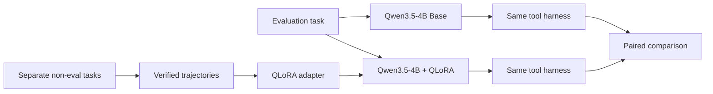

<h1 align="center">Small-Agent QLoRA</h1>

<p align="center">
  <strong>Can a local 4B tool agent learn a better tool-use policy with QLoRA — without hiding behind a larger model or benchmark leakage?</strong>
</p>

<p align="center">
  
  
  
  
  
</p>

<p align="center">
  <a href="#the-experiment">Experiment</a> ·
  <a href="#agent-loop">Agent loop</a> ·
  <a href="#current-evidence">Current evidence</a> ·
  <a href="#quickstart">Quickstart</a> ·
  <a href="#evaluation-contract">Evaluation contract</a>
</p>

## At a glance

| | |
|---|---|
| **Question** | Can QLoRA improve the tool-use policy of a small local agent, or does it mostly add training cost? |
| **What I built** | A single-model Qwen3.5-4B agent with `search`, `read`, `inspect`, and `python`, plus trajectory collection, QLoRA training, leakage guards, and a Base-vs-LoRA comparator. |
| **Current answer** | **Unanswered.** The experiment infrastructure exists, but there is no valid Base-vs-LoRA improvement claim yet. |
| **Design focus** | Controlled evaluation, visible trajectories, bounded tool use, and honest stop conditions under local hardware constraints. |

> [!NOTE]
> This repository treats **“QLoRA was not justified by the available evidence”** as a valid outcome. The goal is not to force a fine-tuning success story.

## The experiment

The project isolates one question: **does policy fine-tuning improve the same small agent on the same evaluation tasks?**



The comparison is intentionally paired:

- same base model family
- same tool surface
- same step limits
- same evaluation partition
- same scorer
- only the adapter changes

That makes the result easier to interpret than comparing two unrelated agents.

## Agent loop

```text
user task
   ↓
Qwen3.5-4B
   ↓
choose next action
   ├─ search
   ├─ read
   ├─ inspect
   └─ python
   ↓
observation
   ↓
next action or final answer
```

The harness executes the tool, returns the observation, limits the number of steps, blocks exact duplicate calls, and records the visible action trace.

This is a **single-model loop**, not a planner / router / critic graph.

## Current status

| Component | Status |
|---|---|
| Tool-using agent runtime | ✅ Implemented |
| GAIA evaluation runner | ✅ Implemented |
| Visible trajectory logging | ✅ Implemented |
| Verified trajectory collector | ✅ Implemented |
| Training-data leakage guard | ✅ Implemented |
| QLoRA training entry point | ✅ Implemented |
| Base-vs-LoRA comparator | ✅ Implemented |
| Valid trained adapter for final comparison | ⏳ Not yet established |
| Final Base-vs-LoRA result | ⏳ Not yet established |

## Current evidence

An earlier diagnostic attempt stopped after **13 persisted tasks** because the machine crossed the RAM safety guard. It is preserved as debugging evidence, not presented as a complete benchmark.

| Partial diagnostic fact | Result |
|---|---:|
| Persisted tasks | 13 / 25 |
| Exact match | 2 / 13 |
| Completed tasks | 6 / 13 |
| Model calls | 118 |
| Tool calls | 112 |
| Tool success | 81.25% |
| Stop reason | available RAM below guard threshold |

> [!IMPORTANT]
> These numbers are a **partial prefix**, not a Diagnostic25 accuracy result and not evidence that QLoRA helps. No adapter was trained from this run.

The preserved decision record is in [`docs/p4-decision.md`](docs/p4-decision.md).

## Evaluation contract

The GAIA validation set is split into separate internal partitions:

```text
GAIA validation: 165

Diagnostic:       25
Evaluation:      100
Unused:           40
```

The contract is:

1. Use the 25 diagnostic tasks to identify agent-policy failure modes.
2. Build training data separately — **do not copy GAIA questions or answers**.
3. Keep only verified tool-use trajectories that pass the collection checks.
4. Train one QLoRA adapter.
5. Run Base and +LoRA on the same frozen 100-task evaluation partition.
6. Compare task-by-task transitions, not just one aggregate score.

This is an **internal controlled evaluation setup**, not an official GAIA leaderboard submission.

## Training-data guard

GAIA questions are hashed locally and checked against candidate training inputs. Sources marked as GAIA are rejected from the training path.

This catches exact reuse. It **does not** detect a paraphrased benchmark question, so provenance still requires manual judgment.

## Quickstart

Install the pieces you need:

```powershell
python -m pip install -e ".[eval,search,files,train]"
```

Run one question:

```powershell
small-agent run "your question here"
```

Run the diagnostic partition:

```powershell
small-agent gaia-eval `
  --partition diagnostic `
  --backend transformers `
  --work-root runs/gaia-diagnostic-base
```

Collect verified training trajectories:

```powershell
small-agent collect-trajectories `
  --tasks data/policy-tasks.jsonl `
  --output data/verified-trajectories.jsonl `
  --backend transformers `
  --protected-questions runs/gaia-protected-question-hashes.json
```

Train an adapter:

```powershell
small-agent train-qlora `
  --data data/verified-trajectories.jsonl `
  --output adapters/qwen3.5-4b-tool-policy `
  --protected-questions runs/gaia-protected-question-hashes.json
```

Then run Base and +LoRA on the frozen evaluation partition and compare them with `small-agent compare-evals`.

## What gets recorded

For each task the runner keeps:

- final answer and correctness
- stop reason and step count
- tool calls and tool errors
- duplicate-call blocks
- visible action trace

It also separates tasks that the current tools can reasonably handle from tasks that need semantic image / audio / video understanding.

The current `inspect` tool reads document and tabular structure; it is **not** a general vision or audio model.

## Repository shape

```text
small-agent-qlora/
├── src/gaia_small_agent/
│   ├── agent/
│   ├── model/
│   ├── tools/
│   ├── benchmark/
│   └── training/
├── docs/
└── tests/
```

## Limits

- The Python tool is process-isolated and time-limited, but not a hardened hostile-code sandbox.
- `inspect` does not provide semantic image / audio / video understanding.
- Search uses the live web, so exact results can change.
- Exact hash checks do not catch paraphrased benchmark leakage.
- The Transformers / QLoRA path needs a compatible local CUDA / PyTorch / bitsandbytes setup.
- No final Base-vs-LoRA claim should be made until a valid paired run completes.

## References

- [Pi minimal harness](https://pi.dev/)
- [Qwen3.5-4B](https://huggingface.co/Qwen/Qwen3.5-4B)
- [GAIA dataset](https://huggingface.co/datasets/gaia-benchmark/GAIA)
- [GAIA scorer](https://huggingface.co/spaces/gaia-benchmark/leaderboard/blob/main/scorer.py)
